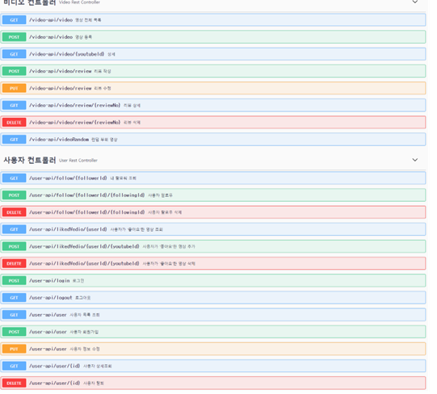
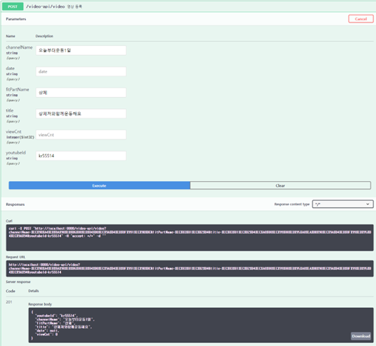
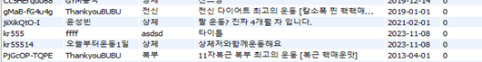
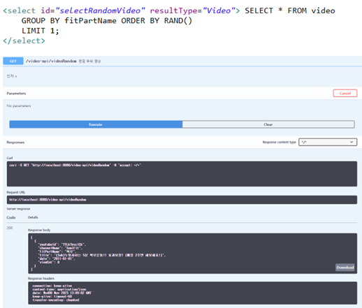

# Spring Boot, MySQL을 활용한 헬스 동영상 프로그램 REST API화 

1. 프로젝트 개요
진행 기간 : 1달  
인원 : 2명  
역할 : 초기 모델 view 부분 구현, Video 컨트롤러 구현, DB 연결 및 SWAGGER를 활용한 REST API화  
개발 환경 : Spring Boot, Swagger, MySQL   
목적 및 필요성 : Spring 프레임워크를 활용하여 MVC 패턴 구현, DB 연결 및 REST API화로 BACKEND 프로젝트의 전체 과정의 학습 및 명세서에 충실한 결과물 내기
주요 기능 : 조회수, 부위 별 운동 영상 추천, 자체 사이트 내 리뷰 작성, 수정 및 삭제  

2. 완성 API 모습
- 컨트롤러 구현 API  

- MySQL DB와 API의 POST기능 통신 모습   


- 랜덤비디오 추천     


3. 내부 코드 
``` java
@Autowired
	private VideoService videoService;

	// 1. 영상 전체 목록(검색조건 있을 수도 있고 없을 수도 있다.)
	@GetMapping("/video")
	@ApiOperation(value="영상 전체 목록", notes="인자가 없다")
	public ResponseEntity<?> list(){
		
		List<Video> list = videoService.getVideos(); //전체 조회
		if(list == null || list.size() == 0)
			return new ResponseEntity<Void>(HttpStatus.NO_CONTENT);
		
		return new ResponseEntity<List<Video>>(list, HttpStatus.OK);
	}
	
	// 2. 영상 상세
	@GetMapping("/video/{youtubeId}")
	@ApiOperation(value = " 상세")
	public ResponseEntity<?> detail(@PathVariable String youtubeId){
		Map<Video, List<Review>> map = new HashMap<>();
	
		Video video = videoService.getVideo(youtubeId);
		List<Review> review = videoService.getAllReview(youtubeId);
		map.put(video, review);
		
		return new ResponseEntity<Map<Video, List<Review>>>(map, HttpStatus.OK);
	}
	
	// 3. 영상 등록
	@PostMapping("/video")
	@ApiOperation(value = "영상 등록")
	public ResponseEntity<Video> write(Video video){
		videoService.writeVideo(video);
	
		return new ResponseEntity<Video>(video, HttpStatus.CREATED);
	}
	
	
	//4. 리뷰 작성
	@PostMapping("/video/review")
	@ApiOperation(value = "리뷰 작성")
	public ResponseEntity<Void> writeReview(@RequestBody Review review){
		videoService.writeReview(review);
		
		return new ResponseEntity<Void>(HttpStatus.ACCEPTED);
	}
	
	//5. 리뷰 수정
	@PutMapping("/video/review")
	@ApiOperation(value = "리뷰 수정")
	public ResponseEntity<Void> updateReview(@RequestBody Review review){
		videoService.modifyReview(review);
		
		return new ResponseEntity<Void>(HttpStatus.ACCEPTED);
	}
	
	//6. 리뷰 삭제
	@DeleteMapping("/video/review/{reviewNo}")
	@ApiOperation(value = "리뷰 삭제")
	public ResponseEntity<Void> deleteReview(@PathVariable int reviewNo){
		videoService.removeReview(reviewNo);
		
		return new ResponseEntity<Void>(HttpStatus.OK);
	}
	
	//7. 리뷰 상세
	@GetMapping("/video/review/{reviewNo}")
	@ApiOperation(value = "리뷰 상세")
	public ResponseEntity<Review> readReview(@PathVariable int reviewNo){
		return new ResponseEntity<Review>(videoService.getDetailReview(reviewNo), HttpStatus.OK);
	}
```

4. 